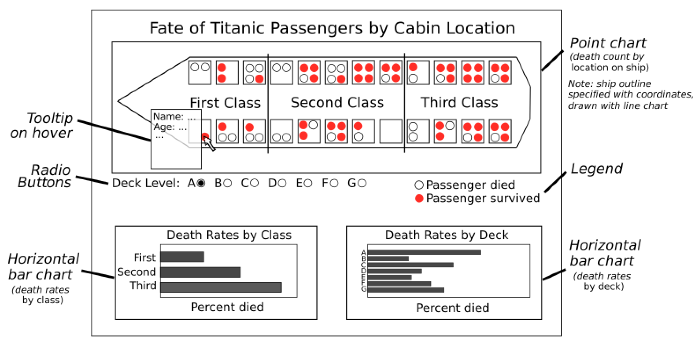

# DSCI 532 - GROUP 109: Titanic Dashboard Project

## Link to app

Please click the link below to view and use our app: 

[DSCI 532 Group 109 Titantic Dashboard App](https://dsci-532-group-109-milestone2.herokuapp.com/)

## Functionality

This app consists of a dashboard containing visualizations related to the survival of passengers on the Titanic ship based on their cabin location. Users can select specific decks on the ship via a drop down menu and see whether the passengers in each cabin survived or died during the disaster.  

Additionally, users can hover over individual data points to view personal information related to that passenger, such as their name, age and gender. 

In additional to this visualization, two bar graphs allow users to see the aggregate death rates as a function of passenger class and deck level. A sketch of the dashboard is included below. Note that this was a priliminary sketch, and so the current, updated dashboard described above contains some different features. 

Please click the link below to view and use our app  

[DSCI 532 Group 109 Titantic Dashboard App](https://dsci-532-group-109-milestone2.herokuapp.com/)